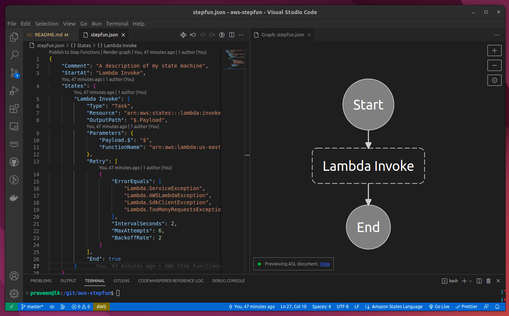
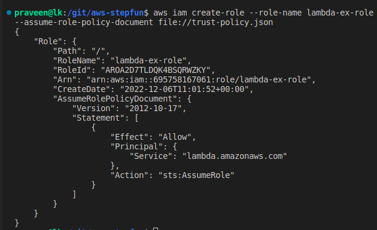
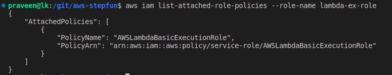
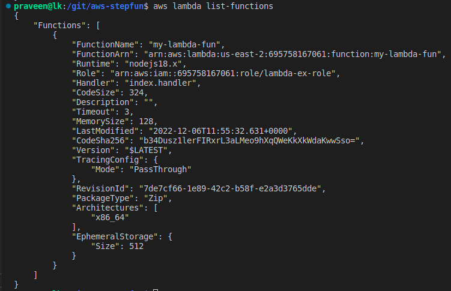
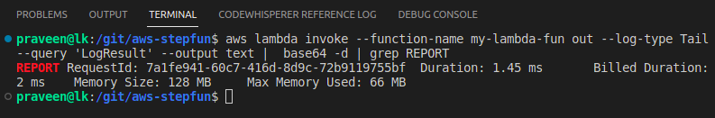
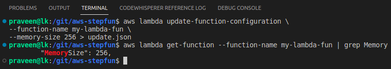
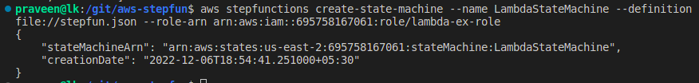
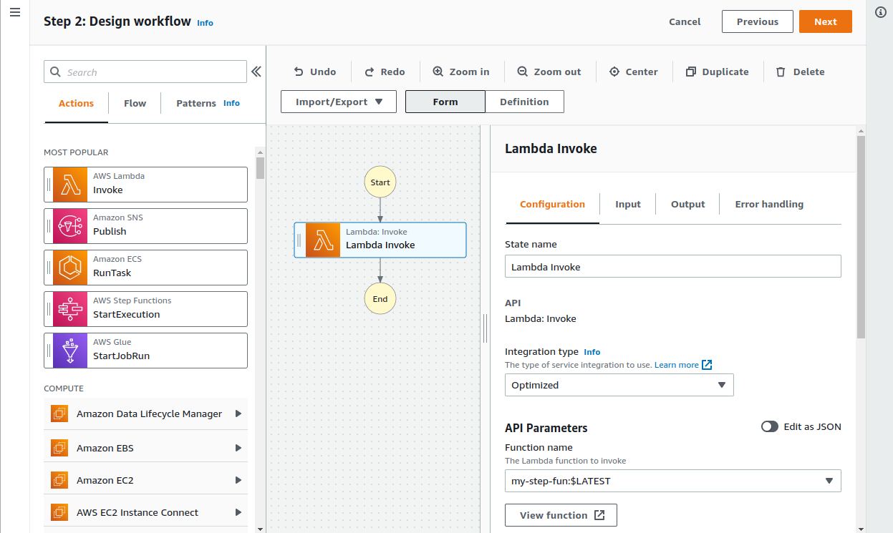
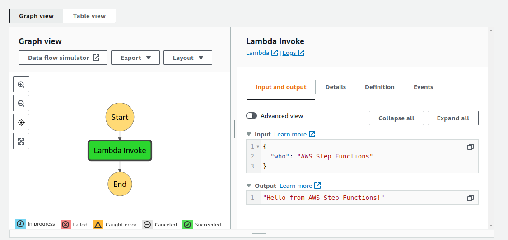

# AWS Step Functions

## Please Welcome, Serverless Workflow Orchestration

https://aws.amazon.com/step-functions/

Business logic, not plumbing!

## Amazon States Language

https://states-language.net/

```
{
    "Comment": "A simple minimal example of the States language",
    "StartAt": "Hello World",
    "States": {
    "Hello World": {
      "Type": "Task",
      "Resource": "arn:aws:lambda:us-east-1:123456789012:function:HelloWorld",
      "End": true
    }
  }
}
```



# Create IAM Role for Execution

```
aws iam create-role --role-name lambda-ex-role --assume-role-policy-document file://trust-policy.json
```



```
aws iam get-role --role-name lambda-ex-role > lambda-ex-role.json
aws iam list-attached-role-policies --role-name lambda-ex-role > policies-1.json
```

# Attach Policy to Role
```
aws iam attach-role-policy --role-name lambda-ex-role --policy-arn arn:aws:iam::aws:policy/service-role/AWSLambdaBasicExecutionRole
aws iam list-attached-role-policies --role-name lambda-ex-role > policies-2.json
```



# Create Lambda Function

```
zip function.zip index.js
aws lambda create-function --function-name my-lambda-fun \
--zip-file fileb://function.zip --handler index.handler --runtime nodejs18.x \
--role arn:aws:iam::695758167061:role/lambda-ex-role
```



## Invoke the Lambda

```
aws lambda invoke --function-name my-lambda-fun out --log-type Tail
aws lambda invoke --function-name my-lambda-fun out --log-type Tail --query 'LogResult' --output text |  base64 -d
```



## Update Memory Limit

```
aws lambda update-function-configuration \
--function-name my-lambda-fun \
--memory-size 256
```



# State Machine



```
aws iam create-role --role-name step-ex-role --assume-role-policy-document file://step-trust-policy.json

aws iam attach-role-policy --role-name step-ex-role --policy-arn arn:aws:iam::aws:policy/AWSLambda_FullAccess

aws stepfunctions create-state-machine --name LambdaStateMachine --definition file://stepfun.json --role-arn arn:aws:iam::695758167061:role/step-ex-role
```




# Done



# Clear History

```
aws iam detach-role-policy --role-name lambda-ex-role --policy-arn arn:aws:iam::aws:policy/service-role/AWSLambdaBasicExecutionRole

aws iam detach-role-policy --role-name step-ex-role --policy-arn arn:aws:iam::aws:policy/AWSLambda_FullAccess

aws iam delete-role --role-name lambda-ex-role

aws iam delete-role --role-name step-ex-role

aws lambda delete-function --function-name my-lambda-fun

aws stepfunctions delete-state-machine --state-machine-arn arn:aws:states:us-east-2:695758167061:stateMachine:LambdaStateMachine
```

# More Information

Build on Serverless | Breaking the Monolith with Step Functions

https://www.youtube.com/watch?v=CFelZoLjF50